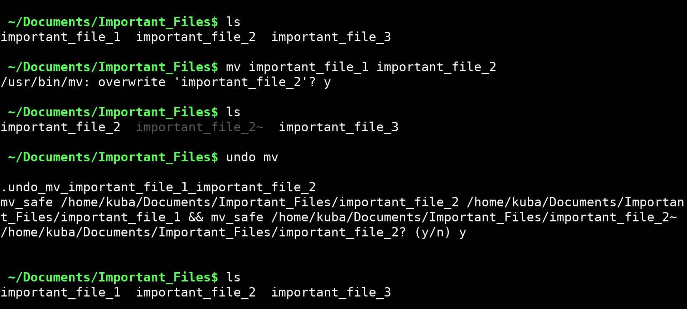

# Undo actions for Linux terminal

Here you can find the **[mv_safe](mv_safe)** script that tracks operations' history, allowing you to easily revert them with the **[undo](undo)** script.


## Features

The [mv_safe](mv_safe) file uses the **mv** with *-b* and *-i* options, which means it asks you before overwriting a file, and creates a backup for it.

It has almost all the functionalities the standard **mv** command has, including:
- renaming a file or directory,
- overwrtiting a file,
- moving a file or directory into another directory.


## Installation

To use the script, copy the [mv_safe](mv_safe) file to a directory included in your `$PATH`, for example:

```bash
cp mv_safe ~/bin/
chmod +x ~/bin/mv_safe
```


## Configuration 

I recommend setting an alias to replace the default **mv** command with *mv_safe*:

```bash
alias mv='mv_safe'
```
Add this line to your ~/.bashrc or ~/.zshrc file, and then run:
```bash
source ~/.bashrc # (or ~/.zshrc)
```


## Usage



## Undo removing files

My initial plan was to write the undo script both for *mv* and *rm*. However, this would not be necessary - since there is a **[gio trash](https://developer.gnome.org/gio/stable/gio.html)** command that already provides such functionality.

To make the **rm** command move files into trash instead of deleting them permamently, you can create an alias:

```bash
alias rm='gio trash
```
